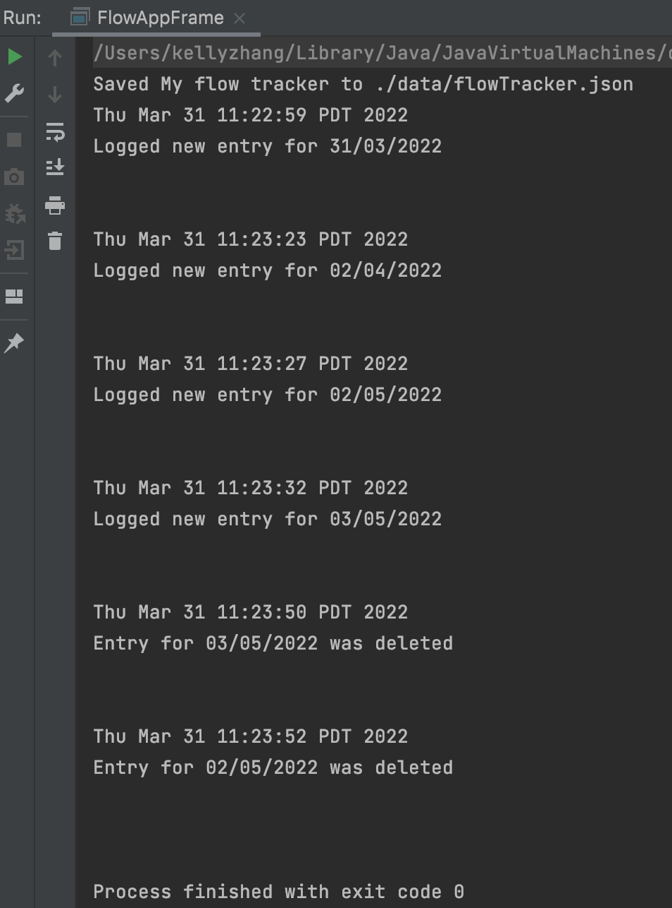

# My Personal Project

##Motivation for the Project:
*My idea for my personal project is something that emulates the functionalities of existing menstrual cycle apps.
By recording the days that they are menstruating, women can keep track of their health through the patterns they
observe in the days they track. The menstruation cycle is an important indicator for many aspects of women's health. I
personally thought it would be interesting to construct one myself because of its calendar-like and journal-like 
functionalities as well as the fact that I personally use similar applications, which has offered me greater insight 
into my health. For example, many young women experience anemia as a result of their heavy periods and apps like these
helps them to better understand their experiences.*

## User Stories
- As a user, I want to be able to log the days that I am on my menstrual cycle. 
- As a user, I want to be able to log my mood, flow, and symptoms for those days.
- As a user, I want to be able to view the days I have logged for each month.
- As a user, I want to be able to delete a previously logged day.
- As a user, I want to be able to be prompted to save my logged days to a file before exiting. 
- As a user, when I start the application, I want to be given the option to load my to-do list from file.

## Phase 4: Task 2

## Phase 4: Task 3
Looking at my UML diagram, I feel that there is some redundancy between my Frame UI classes. In formatting the frames,
I could have potentially made an abstract class that EntryFrame, FlowAppFrame, and ViewFrame would extend to 
avoid duplicating code when setting the size, format, and other design elements of the frames. I would not use an
interface because the functionality of the frames differ from each other. Perhaps making my FlowApp UI class 
an abstract class and having my GUI extend it would reduce the amount of similar code between the classes. I believe
that performing refactoring on my model classes would not be the best design choice as they do not share similar
functionality but are rather dependent on each other. 

In terms of other areas of improvement, I would also look into making my program more robust by adding exception
classes where appropriate as I currently have quite a few "if statements" that function similarly to what exceptions
do, but does not improve the robustness of the program. For example, when a user logs an entry incorrectly due to 
poor date formatting, I could replace the if statement I have in my EntryFrame class with an exception that could also 
be applied to other places with similar user errors. Additionally, I would also reorganize my JSwing elements to be 
sorted into lists, such as having a list of JButtons in comparison to my current long list of fields that makes my 
code harder to read and interpret.

## Citations
- JsonSerializationDemo (https://github.students.cs.ubc.ca/CPSC210/JsonSerializationDemo)
- TellerApp (https://github.students.cs.ubc.ca/CPSC210/TellerApp)
  

